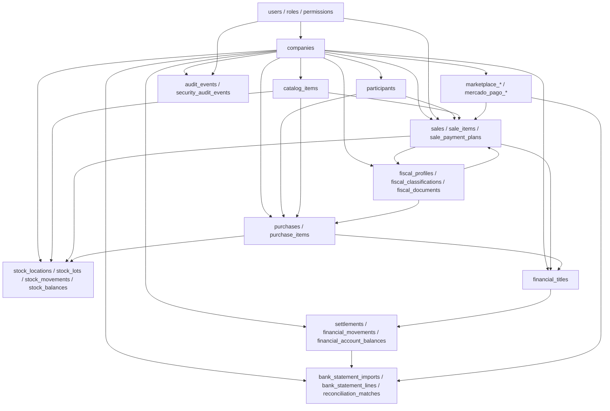

# MAPA GLOBAL DO BANCO DE DADOS

Status: documento oficial do banco para a fase local do Kovir ERP 1.0.0.

Este mapa foi consolidado a partir do schema SQLAlchemy, migrations Alembic e
documentos tecnicos ainda aderentes ao projeto atual. Documentos antigos que
citarem tabelas, AWS, deploy remoto ou funcionalidades futuras devem ser
tratados como historicos, nao como fonte de verdade.

## 1. Premissas do banco

- Banco oficial: PostgreSQL.
- Versionamento: Alembic em `backend/alembic/versions`.
- ORM: SQLAlchemy 2.x, metadata carregado por `backend/app/db/base.py`.
- Isolamento multiempresa: tabelas operacionais usam `company_id`.
- Chaves primarias: strings tecnicas, normalmente `String(80)`.
- Valores monetarios: `Numeric(18, 2)`.
- Snapshots e payloads externos: `JSONB` quando o schema atual suporta consulta estruturada.
- Excecao atual: `fiscal_documents.focus_response_json` e `Text`, apesar do nome sugerir JSON.
- Registros financeiros, fiscais, estoque, conciliacao e auditoria devem ser preservados por status, cancelamento ou estorno; delecao fisica nao e o fluxo normal.
- AWS/deploy remoto esta cancelado por enquanto. O banco deve ser lido como ambiente local de desenvolvimento, nao como stack AWS ativa.
- O PostgreSQL local pode rodar via `backend/docker-compose.yml` apenas como helper isolado, usando porta host `5433`, container `kovir-erp-postgres`, volume `kovir_erp_postgres_data` e rede `kovir_erp_postgres_net`.

## 2. Linha do tempo das migrations

| Grupo | Migrations | Resultado |
|---|---:|---|
| Base multiempresa | `20260428_0001` | `companies`, `audit_events` |
| Cadastros base | `0002` a `0004` | participantes, catalogo, perfis e classificacoes fiscais |
| Vendas | `0005` a `0010` | vendas, itens, natureza da operacao, planos e meios de pagamento |
| Marketplaces | `0011` | contas externas, pedidos, pagamentos e sincronizacoes |
| Mercado Pago | `0012` | contas, preferencias, pagamentos, estornos, liberacoes, webhooks |
| Estoque | `0013`, `0014`, `0022`, `0029` | locais, saldos, movimentos, entradas, lotes e vinculos de venda |
| Financeiro | `0015` a `0018`, `0020`, `0023` | plano financeiro, titulos, baixas, movimentos, saldos, conciliacao e fechamento |
| Compras/Pagar | `0019` | compras, itens, historico e vinculos financeiros |
| Seguranca/alcadas | `0021`, `0036` | usuarios, roles, permissoes, sessoes, aprovacoes, senha mestre e permissao de venda |
| Fiscal operacional | `0024` a `0028` | documentos fiscais preparatorios, campos NFe em empresa, vida da venda e senha mestre |
| Performance | `0030` a `0035` | indices compostos para financeiro, caixa, fluxo, conciliacao, compras e estoque |

Observacao critica: a migration `20260430_0020` adiciona `financial_titles.title_name` e indice por nome, mas o modelo SQLAlchemy atual de `financial_titles` nao declara essa coluna. Alguns relatorios consultam `ft.title_name`. Isso deve ser corrigido antes de tratar a coluna como contrato consolidado.

## 3. Mapa relacional macro



## 4. Regras transversais de integridade

| Regra | Aplicacao obrigatoria |
|---|---|
| Tenant scope | Toda query operacional deve filtrar por `company_id`; `users`, `roles` e `permissions` sao globais, mas vinculos e sessoes sao por empresa. |
| Idempotencia | Tabelas de fatos gerados por processo usam combinacoes como `company_id + source_type + source_id` ou IDs externos unicos. |
| Historico | Mudancas de status relevantes devem gerar historico/auditoria, nao sobrescrever evidencias sem rastro. |
| Soft delete | Cadastros possuem `deleted_at`; fatos financeiros/fiscais/estoque usam status, cancelamento ou estorno. |
| Snapshots | Vendas, compras, titulos, itens, fiscal e integracoes guardam snapshots para preservar o contexto da transacao. |
| Saldos materializados | `stock_balances`, `stock_lots` e `financial_account_balances` sao saldos derivados; a trilha auditavel fica nos movimentos. |
| Extrato externo | `bank_statement_lines` e tabelas externas nao alteram saldo interno sozinhas; conciliacao cria vinculo auditavel com movimento interno. |
| Constraints | Regras criticas devem ser sustentadas por FKs, uniques e indices, alem das validacoes em service. |

## 5. Inventario por dominio

### 5.1 Empresas e auditoria

| Tabela | Papel | Integridade principal |
|---|---|---|
| `companies` | Raiz do tenant/empresa, dados cadastrais, fiscais e parametros operacionais. | `cnpj` unico; indices por status, criacao e atualizacao. |
| `audit_events` | Auditoria geral de entidades e eventos de negocio. | `company_id` opcional com `SET NULL`; indices por empresa/data, entidade, evento, request e correlation. |
| `security_audit_events` | Auditoria especifica de seguranca/autenticacao/autorizacao. | `company_id` e `user_id` opcionais com `SET NULL`; indices por empresa, usuario, evento e data. |

### 5.2 Seguranca, usuarios e alcadas

| Tabela | Papel | Integridade principal |
|---|---|---|
| `users` | Usuarios globais. | `email` unico; senha persistida por hash/salt; indices por status e criacao. |
| `company_users` | Associacao usuario-empresa. | Unico por `company_id,user_id`; cascade por empresa/usuario. |
| `roles` | Papeis globais. | `code` unico. |
| `permissions` | Permissoes globais. | `code` unico. |
| `role_permissions` | Permissoes por papel. | Unico por `role_id,permission_id`; cascade. |
| `user_roles` | Papel do usuario dentro de uma empresa. | Unico por `user_id,role_id,company_id`. |
| `user_sessions` | Sessoes Bearer por usuario e empresa ativa. | `token_hash` unico; indices por usuario, empresa, status e expiracao. |
| `approval_policies` | Politicas de alcada por empresa e acao. | Unico por `company_id,action_key`. |
| `approval_requests` | Solicitacoes de aprovacao. | Indices por empresa/status e alvo. |
| `approval_decisions` | Decisoes de aprovadores. | Unico por `approval_request_id,actor_user_id`. |
| `master_passwords` | Senha mestre por empresa para reabrir venda fechada. | Unico por `company_id`; hash/salt persistidos, nunca senha em claro. |

### 5.3 Cadastros operacionais

| Tabela | Papel | Integridade principal |
|---|---|---|
| `participants` | Clientes, fornecedores, transportadores e outros participantes. | `company_id,document` unico quando documento nao vazio; indices por tipo, status, nome e datas. |
| `catalog_items` | Produtos/servicos. | `company_id,sku` e `company_id,barcode` unicos quando nao vazios; indices por tipo, status, nome, marca, categoria, NCM/NBS. |
| `operation_natures` | Natureza de operacao para venda/compra/fiscal/estoque/financeiro. | Indices por empresa, codigo, status e tipo de venda. |
| `payment_methods` | Meios de pagamento por empresa. | Unico por `company_id,code`; indices por tipo e status. |

### 5.4 Fiscal e classificacao

| Tabela | Papel | Integridade principal |
|---|---|---|
| `fiscal_profiles` | Perfis fiscais parametrizaveis por empresa. | Nome unico por empresa quando nao vazio; validade, regime e aplicacao indexados. |
| `fiscal_classifications` | Classificacao fiscal por item/servico/regime, incluindo NCM/NBS/CFOP/CST/IBS/CBS/IS. | Indices por empresa, perfil, status, validade, regime, NCM/NBS, CFOP e campos da reforma tributaria. |
| `catalog_item_fiscal_rules` | Regra que vincula item, classificacao fiscal e natureza de operacao. | FKs para catalogo, classificacao, natureza e empresa; indices por item, classificacao, natureza, tipo e status. |
| `fiscal_documents` | Registro preparatorio/operacional de NF-e/NFC-e via Focus NFe vinculado a venda. | `reference` unico; FKs para empresa e venda; indices por empresa/status, empresa/tipo, venda, chave de acesso e criacao. |

Observacoes fiscais:

- `fiscal_documents` nao substitui venda, financeiro ou estoque.
- XML, DANFE, protocolo, chave de acesso e resposta do provedor sao evidencias fiscais, nao fonte primaria de estoque/financeiro.
- O modelo atual nao possui tabelas separadas para itens fiscais documentais, eventos fiscais ou XML persistido estruturado.
- `focus_response_json` esta como `Text`; migrar para `JSONB` exige backfill e compatibilidade com respostas existentes.

### 5.5 Vendas

| Tabela | Papel | Integridade principal |
|---|---|---|
| `sales` | Cabecalho da venda, status, natureza, datas, totais, numeracao e atores. | `company_id,sale_number` unico quando preenchido; indices por empresa/status, datas, participante, fiscal, tipo e natureza. |
| `sale_items` | Itens da venda com snapshots de item, fiscal e natureza. | FK para venda com cascade; FKs para item, classificacao fiscal, lote e empresa; indices por item, lote e fiscal. |
| `sale_payment_plans` | Plano financeiro previsto da venda. | FK para venda com cascade; indices por empresa/venda, vencimento, metodo e status. |
| `sale_financial_links` | Vinculo entre venda/plano e titulo financeiro gerado. | Unico por `company_id,sale_payment_plan_id,financial_title_id`. |
| `sale_sequences` | Sequencia numerica por empresa para `sale_number`. | Unico por `company_id`. |
| `sale_status_history` | Historico de status da venda. | FK para venda com cascade; indices por venda e ocorrencia. |
| `sale_stock_links` | Vinculo entre venda/itens e movimentos de estoque gerados. | FKs para venda/item com cascade e movimento com restrict. |

Fluxo persistido:

```text
sales
-> sale_items
-> sale_payment_plans
-> sale_financial_links -> financial_titles
-> sale_stock_links -> stock_movements
-> fiscal_documents
```

### 5.6 Compras e contas a pagar

| Tabela | Papel | Integridade principal |
|---|---|---|
| `purchases` | Cabecalho da compra, documento, participante, totais, fiscal e financeiro esperado. | Indices por empresa/status, participante, documento, competencia, operacao, categoria e tipo. |
| `purchase_items` | Itens da compra com snapshots de item/fiscal. | FK para compra com cascade; FKs para item, classificacao e empresa. |
| `purchase_financial_links` | Vinculos da compra com titulos financeiros payable. | Unico por `company_id,financial_title_id` e por `company_id,purchase_id,installment_number`. |
| `purchase_status_history` | Historico de status da compra. | FK para compra com cascade; indices por compra e ocorrencia. |

Compras geram ou vinculam titulos em `financial_titles` com `direction='payable'`.

### 5.7 Financeiro, titulos e parametros

| Tabela | Papel | Integridade principal |
|---|---|---|
| `chart_accounts` | Plano de contas gerencial/contabil por empresa. | Unico por `company_id,code`; hierarquia por `parent_id`. |
| `financial_categories` | Categorias financeiras operacionais. | Unico por `company_id,code`; pode mapear para plano de contas. |
| `cost_centers` | Centros de custo/resultado. | Unico por `company_id,code`; hierarquia por `parent_id`. |
| `financial_accounts` | Contas de caixa, banco, gateway, marketplace/intermediador. | Indices por empresa, status, tipo e nome. |
| `payment_terms` | Condicoes de pagamento/recebimento. | Unico por `company_id,name`. |
| `financial_period_closures` | Fechamento de periodo financeiro por empresa. | Indices por periodo e status. |
| `financial_titles` | Titulo financeiro a receber ou a pagar. | Unico por `company_id,source_type,source_id`; indices por direcao, status, vencimento, participante, conta, venda, fiscal e cobranca. |
| `financial_title_history` | Historico de status/cobranca do titulo. | FK para titulo com cascade; indices por titulo e ocorrencia. |

Fluxo de titulo:

```text
sales ou purchases
-> financial_titles
-> financial_title_history
-> settlements
-> financial_movements
-> financial_account_balances
```

### 5.8 Caixa, baixas e saldos

| Tabela | Papel | Integridade principal |
|---|---|---|
| `settlements` | Baixa/liquidacao de titulo. | Unico por `company_id,source_type,source_id`; indices por titulo, conta, data, status, metodo e source. |
| `financial_movements` | Movimento interno de caixa/banco/gateway. | Unico por `company_id,source_type,source_id`; indices por conta/data/status/tipo/direcao/reconciliacao/source/titulo. |
| `financial_account_balances` | Saldo materializado por conta financeira. | Unico por `company_id,financial_account_id`; referencia ultimo movimento. |

Regras:

- Baixa nao e conciliacao bancaria.
- Movimento interno nao deve ser apagado; correcao ocorre por estorno/reversao.
- Saldo materializado deve ser atualizado dentro da mesma transacao que cria/estorna movimento.
- Movimentos reconciliados exigem cuidado antes de reversao, pois existem vinculos em conciliacao.

### 5.9 Conciliacao

| Tabela | Papel | Integridade principal |
|---|---|---|
| `bank_statement_imports` | Lote externo de extrato bancario/gateway. | Unico por `company_id,financial_account_id,source_type,source_id`; indices por conta, periodo e status. |
| `bank_statement_lines` | Linha externa importada. | Unico por `company_id,financial_account_id,external_id`; indices por conta, data, status, valor e lote. |
| `reconciliation_matches` | Match auditavel entre linha externa e movimento interno. | Unico por `statement_line_id,financial_movement_id`; indices por empresa, conta, status, linha e movimento. |

Regras:

- Extrato externo nao altera saldo interno.
- Conciliacao confirma equivalencia entre fato externo e `financial_movements`.
- Reversao de conciliacao deve preservar historico e atualizar status da linha/movimento.

### 5.10 Estoque

| Tabela | Papel | Integridade principal |
|---|---|---|
| `stock_locations` | Locais de estoque por empresa. | Unico por `company_id,code`; indices por padrao, tipo e status. |
| `stock_balances` | Saldo materializado por item/local. | PK composta `company_id,item_id,location_id`; indices por item, local e atualizacao. |
| `stock_lots` | Lotes por item/local/validade. | Unico por `company_id,item_id,location_id,lot_code,expiration_date`; indices por item, local, validade e status. |
| `stock_movements` | Movimento auditavel de estoque. | Indices por item, local, lote, data, status, tipo, source, venda e item da venda. |
| `stock_purchase_entries` | Entrada fiscal/operacional de estoque por documento. | Indices por fornecedor, local, documento, chave de acesso, status e data. |
| `stock_purchase_entry_items` | Itens da entrada de estoque. | FKs para entrada, item, lote e movimento; indices por entrada, item, lote e movimento. |

Regras:

- `stock_movements` e a trilha auditavel.
- `stock_balances` e `stock_lots` sao derivados e devem ser alterados de forma transacional.
- Saidas de venda devem vincular lote quando aplicavel.
- Entradas de compra podem criar/atualizar lote e gerar movimento.

### 5.11 Marketplaces

| Tabela | Papel | Integridade principal |
|---|---|---|
| `marketplace_accounts` | Conta externa generica por empresa. | Unico por `company_id,provider_code,display_name`; indices por provider, tipo, status e conexao. |
| `marketplace_external_orders` | Pedido externo importado. | Unico por `company_id,provider_code,external_order_id`; pode vincular venda interna. |
| `marketplace_payment_events` | Evento externo de pagamento. | Unico por `company_id,provider_code,external_payment_id`; pode vincular venda/plano. |
| `marketplace_sync_runs` | Execucao de sincronizacao. | Indices por conta, tipo, status e inicio. |

Regra: marketplaces preservam fatos externos e rastreabilidade; nao substituem venda, titulo, baixa ou conciliacao internos.

### 5.12 Mercado Pago

| Tabela | Papel | Integridade principal |
|---|---|---|
| `mercado_pago_accounts` | Conta Mercado Pago por empresa. | Unico por `company_id,display_name`; indices por status, conexao, credenciais, collector e user externo. |
| `mercado_pago_checkout_preferences` | Preferencias de checkout. | Unico por `company_id,external_preference_id`; vinculos opcionais a venda/plano. |
| `mercado_pago_payments` | Pagamentos externos. | Unico por `company_id,external_payment_id`; vinculos opcionais a venda/plano/preferencia. |
| `mercado_pago_refunds` | Estornos externos. | Unico por `company_id,external_refund_id`; vinculo opcional a pagamento. |
| `mercado_pago_releases` | Liberacoes/repasse. | Unico por `company_id,external_release_id`; indices por status e datas. |
| `mercado_pago_chargebacks` | Chargebacks. | Unico por `company_id,external_chargeback_id`; indices por pagamento, status e vencimento. |
| `mercado_pago_webhook_events` | Eventos webhook recebidos. | Unico por `company_id,external_event_id`; indices por topico, recurso, processamento e recebimento. |
| `mercado_pago_oauth_states` | Estados OAuth. | Unico por `company_id,state`; indices por conta, status e expiracao. |

Regra: Mercado Pago e camada de integracao externa. O fato financeiro interno continua em `financial_titles`, `settlements`, `financial_movements` e conciliacao.

## 6. Tabelas oficiais atuais

Inventario confirmado pelo metadata SQLAlchemy:

```text
approval_decisions
approval_policies
approval_requests
audit_events
bank_statement_imports
bank_statement_lines
catalog_item_fiscal_rules
catalog_items
chart_accounts
companies
company_users
cost_centers
financial_account_balances
financial_accounts
financial_categories
financial_movements
financial_period_closures
financial_title_history
financial_titles
fiscal_classifications
fiscal_documents
fiscal_profiles
marketplace_accounts
marketplace_external_orders
marketplace_payment_events
marketplace_sync_runs
master_passwords
mercado_pago_accounts
mercado_pago_chargebacks
mercado_pago_checkout_preferences
mercado_pago_oauth_states
mercado_pago_payments
mercado_pago_refunds
mercado_pago_releases
mercado_pago_webhook_events
operation_natures
participants
payment_methods
payment_terms
permissions
purchase_financial_links
purchase_items
purchase_status_history
purchases
reconciliation_matches
role_permissions
roles
sale_financial_links
sale_items
sale_payment_plans
sale_sequences
sale_status_history
sale_stock_links
sales
security_audit_events
settlements
stock_balances
stock_locations
stock_lots
stock_movements
stock_purchase_entries
stock_purchase_entry_items
user_roles
user_sessions
users
```

Total confirmado: 65 tabelas modeladas.

## 7. Lacunas e riscos atuais

| Risco | Impacto | Acao recomendada |
|---|---|---|
| `financial_titles.title_name` existe em migration e relatorios, mas nao no modelo SQLAlchemy. | Relatorios podem falhar em bancos que seguem apenas metadata/modelo ou em testes com schema recriado pelo ORM. | Alinhar modelo, schemas e services ou remover dependencias da coluna. |
| `fiscal_documents.focus_response_json` e `Text`. | Dificulta consulta estruturada e validacao do payload fiscal. | Avaliar migracao para `JSONB` com backfill seguro. |
| Regras financeiras/fiscais complexas estao majoritariamente nos services. | Risco de inconsistencia se houver escrita por caminho alternativo. | Fortalecer constraints/checks onde a regra for invariavel. |
| Fluxo fiscal oficial completo ainda nao tem tabelas de itens/eventos/XML estruturado. | Emissao fiscal futura pode gerar divida tecnica se usar `fiscal_documents` como solucao final. | Criar evolucao fiscal dedicada antes de NF-e/NFC-e completa. |
| Tabelas de integracao externa guardam payloads brutos. | Risco de dado sensivel e crescimento de armazenamento. | Definir retencao, mascaramento e indices especificos antes de uso produtivo. |
| Helpers/fallbacks de criacao de schema nao substituem Alembic. | Risco de drift entre dev, testes e schema migrado. | Usar Alembic como fonte operacional de evolucao do banco. |

## 8. Checklist para futuras alteracoes de banco

- Criar migration Alembic para toda mudanca de schema.
- Atualizar modelo SQLAlchemy, schemas Pydantic, repositories/services e testes no mesmo ciclo.
- Garantir `company_id` e indice composto em tabelas multiempresa.
- Validar FK, unique, check constraint e indice para toda regra persistente.
- Evitar listagens sem paginacao e sem filtros por tenant.
- Preservar historico/auditoria em fluxos financeiros, fiscais, estoque, conciliacao e seguranca.
- Usar transacao em operacoes que alteram multiplas tabelas.
- Avaliar concorrencia e idempotencia para confirmacao de venda, baixa, estorno, conciliacao, importacao e integracao externa.
- Nao depender de Docker antigo ou deploy AWS antigo para validar banco; a fase atual e local.
